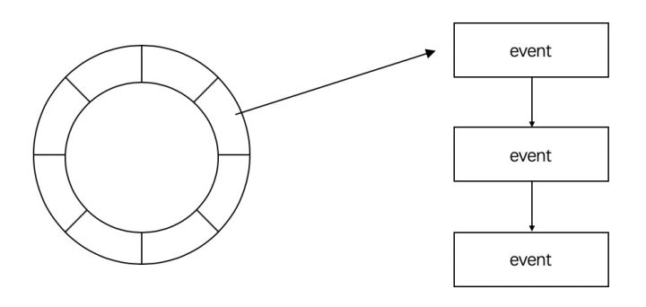
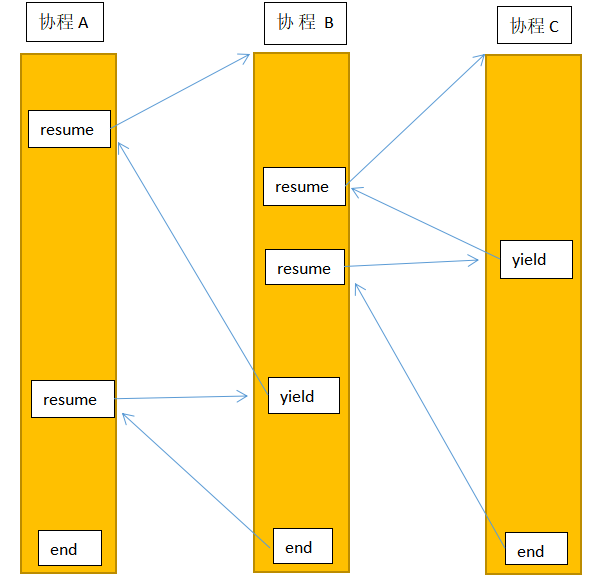

# Batonlib：一个高性能协程库

## Introduction

本项目为C++编写的协程库，并在此基础上封装了网络部分，实现了协程的切换和调度，对系统调用进行封装使开发者不用担心阻塞，实现了协程的同步和通讯。另外还实现了异步日志，记录服务器运行状态。


1. [底层协程切换的原理](#底层协程切换的原理)
2. [时间轮的设计](#时间轮的设计)
3. [协程的设计](#协程的设计)
4. [协程的调度](#协程的调度)
5. [网络库的封装](#网络库的封装)
6. [日志的设计](#日志的设计)
7. [利用Channel来实现协程间通讯](#利用Channel来实现协程间通讯)

## Envoirment

* OS: CentOS 7.6
* Complier: g++ 4.8

## Build

```
make
```

## Example
协程网络库使协程透明化，使用方式与其他通用网络库类似

```
#include "net/server.h"
#include <iostream>

using namespace std;

void connected(connection* conn)
{
    cout<<"connected "<<conn<<endl;
    return;
}

void receive(connection* conn, const char* buf, size_t len)
{
    cout<<"receive data "<<conn<<endl;
    conn->send(buf, len);
    return;
}

void disconnected(connection* conn)
{
    cout<<"disconnected "<<conn<<endl;
    return;
}

int main()
{
    scheduler sch;
    server ser("0.0.0.0", 9981);
    ser.setConnectedCB(connected);
    ser.setReceiveCb(receive);
    ser.setDisconnectedCb(disconnected);
    ser.start();
    sch.event_loop(NULL, NULL);
}
```
当然也可以不使用网络库，利用提供的封装的系统调用，通过协程提供用同步逻辑写异步逻辑的便利。
```
#include "co_sys_call.h"
#include "scheduler.h"
#include "tool.h"
#include "base/Logging.h"
#include <iostream>

using namespace std;

struct listen_inf{
    const char* ip;
    int port;
    listen_inf(const char* ip_, int port_)
    {
        ip = ip_;
        port = port_;
    }
};

void* echo_func(void* arg)
{
    int fd = *(int*)arg;
    char buf[1024*2];
    while(1){
        int len = co_read(fd, buf, sizeof(buf));
        if(len > 0){
            len = co_write(fd, buf, len);
        }
        if(len <= 0){
            if(len != TIME_OUT){
                if(errno == EAGAIN)
                    continue;
                if(errno == EINTR)
                    continue;
            }
            co_close(fd);
            break;
        }
    }
    return NULL;
}

void* accept_func(void* arg)
{
    listen_inf* inf = (listen_inf*)arg;

    int fd = co_socket(AF_INET, SOCK_STREAM, IPPROTO_TCP);
    if(fd >= 0){
        if(inf->port != 0){
            int nReuseAddr = 1;
            setsockopt(fd, SOL_SOCKET, SO_REUSEADDR, &nReuseAddr, sizeof(nReuseAddr));
            struct sockaddr_in addr;
            SetAddr(inf->ip, inf->port, addr);
            int ret = bind(fd, (struct sockaddr*)&addr, sizeof(addr));
            if(ret != 0){
                abort();
            }
        }
    }
    listen(fd, 1024);
    while(1){
        struct sockaddr_in addr;
        memset(&addr, 0, sizeof(addr));
        socklen_t len = sizeof(addr);
        int client_fd = co_accept(fd, (struct sockaddr*)&addr, &len);
        if(fd < 0){
            continue;
        }
        coroutine* co = new coroutine(scheduler::get_curr_thr_sch(),1024*1024, echo_func, (void*)&client_fd);
        co->resume();
    }
}

int main(int argc, char** argv)
{
    listen_inf* inf = new listen_inf("0.0.0.0", 9981);
    scheduler sch;
    coroutine co(&sch, 1024*1024, accept_func, (void*)inf);
    co.resume();
    sch.event_loop(NULL, NULL);
}
```
## Todo

1. 对于多线程的支持。
2. 实现类似golang中用户级的select功能。

## Other

我是一名大三的在读学生，有问题请联系我微信pnzz849816104

感谢libco、libaco、云风的coroutine、muduo等这些优秀开源库对我的启发


## 底层协程切换的原理

协程切换是协程调度的关键，他将一个协程的状态保存并切换到另一个协程中继续执行

### 线程

一般而言，线程具有以下四个要素：
* 执行代码
* 栈
* 堆
* 寄存器

如果我们想要实现一个用户级的线程，即协程，每个协程就需要独立的以上四个属性。其中执行代码由寄存器eip保存。一些数据虽然是在堆中分配的，但他也是借助栈上分配的指针等间接保存的。而栈是由ebp和esp寄存器所保存，所以决定一个协程的要素被简化为寄存器。

### 寄存器（以x86 64位为例）

BATONLIB参考了libco，使用了14个寄存器，存储在reg数组中，分别是：

```
reg[0]: r15   低地址
reg[1]: r14
reg[2]: r13
reg[3]: r12
reg[4]: r9
reg[5]: r8
reg[6]: rbp   栈底
reg[7]: rdi   第一个参数地址
reg[8]: rsi   第二个参数地址
reg[9]: ret   返回函数
reg[10]: rdx
reg[11]: rcx
reg[12]: rbx
reg[13]: rsp  栈顶
```

其中rbp表示栈底，rsp表示栈顶，这两个寄存器表现出栈的环境。rdi和rsi分别表示传入函数的第一个和第二个参数的地址。ret表示函数返回后的地址。

### 协程切换（以x86 64位为例）

协程切换的本质实际就是一个偷梁换柱的把戏，将寄存器的环境改变来实现协程的切换

```
	leaq 8(%rsp),%rax//rax为返回函数的上一个地址
	leaq 112(%rdi),%rsp//rdi存放第一个参数的地址，rsp指向rdi+112的位置，结构体中的参数在栈中是倒着排的，推算下来rsp指向的是ss_size
	pushq %rax //rax存放之前栈的rsp指针+8的地址
	pushq %rbx
	pushq %rcx
	pushq %rdx

	pushq -8(%rax) //ret func addr//这个值为前面的栈返回的地址

	pushq %rsi
	pushq %rdi
	pushq %rbp
	pushq %r8
	pushq %r9
	pushq %r12
	pushq %r13
	pushq %r14
	pushq %r15
	
	movq %rsi, %rsp//rsi为第二个参数的地址，将他作为栈顶指针传给rsp，进入另一个函数
	popq %r15
	popq %r14
	popq %r13
	popq %r12
	popq %r9
	popq %r8
	popq %rbp
	popq %rdi
	popq %rsi
	popq %rax //ret func addr
	popq %rdx
	popq %rcx
	popq %rbx
	popq %rsp
	pushq %rax
	
	xorl %eax, %eax
	ret
```

解析：
首先当前处在调用这个函数的协程所在的栈，有两个参数，第一个参数是当前栈的信息，第二个参数是要切换的目标协程所在栈的信息  
rdi表示第一个参数的地址，rsi为第二个参数的地址，rsp为当前栈顶指针  
第一行将rsp指向地址的上一个地址传给rax，这个值本身没什么用，rax只是作为临时存放rsp地址的变量，为什么是$rsp+8呢，后面分析就知道了  
第二行rdi是第一个参数的地址，要了解112(%rdi)的具体含义，需要了解结构体在栈中的存储方式，首先第一个参数是一个指向结构体的指针，结构体在栈
中的存储为从后往前入栈,coctx_t的结构体为

```
struct coctx_t
{
	void *regs[ 14 ];
	size_t ss_size;
	char *ss_sp;
	
};
```

那么先入栈的是ss_sp，然后是ss_size，最后数组regs也是倒着入栈的，所以最后入栈的是regs[0]  
那么112(%rdi)的位置就可以计算出来是ss_size的位置，将这个位置的地址传给rsp  
接下来就是一系列的push操作，push就可以把值存入rsp的下一个地址，然后自身也指向下一个地址  
第一个pushq %rax 就是将之前栈的rsp指针+8的地址，这个值作为以后重新调用这个协程的rsp的值    
接下来就是其他寄存器的push操作  
-8(%rax) 就是调用coctx_swap函数的函数的地址，即返回地址  
push完后，这个协程的状态就存进了参数一中了，接下来就可以进行协程的切换了  
movq %rsi, %rsp rsi是第二个参数的地址，我们让rsp等于它，便可以对第二个参数进行操作了  
接下来一系列的pop操作就是将第二个参数保存的寄存器状态全部恢复过来  
还记得之前push的-8(%rax)吗，这个是函数的返回地址，我们先把他赋值给rax  
我们让rsp等于之前存进去的rax，这个rax是存放替换的栈的rsp指针+8的地址  
pushq %rax 就可以成功让我们当前的rsp指向当前协程的返回地址了，ret以后便可以继续这个协程的函数执行了！ 

### Other

协程切换我分别参考了libco和云风的coroutine，因为我不需要保存浮点数以及屏蔽信号，所以选择参考了libco的coctx_swap.S。但libco在19年底的时候对coctx_swap.S进行了一次很大的修改，之前都是通过将rdi和rsi的指针给rsp通过pop和push操作保存或恢复寄存器。但是修改以后是通过mov指令来进行操作，因为这个改动，我也更新了自己写的库。对于改动的原因，我觉得可能是这个[issues](https://github.com/Tencent/libco/issues/90)所提到的Sys V ABI约定的问题。所以对于上面代码的解析是针对之前push pop版本的，但其实对于mov版本原理是一样的。

## 时间轮的设计

定时器是网络框架中非常重要的组成部分，往往可以利用定时器做一些超时事件的判断或者定时清理任务等。    

时间轮实际上是一个数组，通过对时间取余来实现循环，这是时间轮的结构。    



每一个时间轮上的元素代表一个刻度，用户可以根据需要选择刻度的单位，有毫秒和秒两个选择。每个刻度有一个链表，链表中的项就是一个超时事件。  
当一个超时事件添加进来时，会计算出响应的超时时间，再将他放入对应的刻度中。  

epoll每过一秒就会检查从时间轮中检查是否有事件超时，当有事件超时时，将他从时间轮中取出并resume相应的协程来执行  

时间轮最大只能支持不超过一分钟的超时事件，这对一般的后台场景足以，如果需要更长的超时事件可以在每个刻度上设置一个rotation，来表示该事件需要时间轮转动多少圈超时，但这样对于超时时间的移除就不是O(1)的时间复杂度了。

## 协程的设计

协程的设计主要是对协程上下文的封装，用户只需要指定协程运行的函数和相应参数，就会在堆上分配协程的栈空间，寄存器状态等。  

协程提供了两个函数，分别是resume()和yield()。resume()可以切换到另一个协程的执行，类似于一个函数调用的过程。yield()可以将当前协程让出，类似于一个函数返回的过程。这里拿函数来举例是因为BATONLIB支持类似函数的递归调用，即resume()到一个协程后可以继续resume()。



## 协程的调度

协程的调度使得开发者在使用系统调用时不需要关心是否阻塞的问题，协程的切换由底层的epoll来实现。但BATONLIB并不需要使用第三方库，所以未hook系统调用，开发者需要使用给定的封装好的系统调用，如co_write,co_read等。

当使用如co_read,co_write等函数时，先将描述符注册到调度器中，然后将协程让出，等到描述符注册的时间到来或者超时时，epoll返回相应事件或者超时事件从时间轮中取出，再在事件循环中重新resume协程，这时的事件已经就绪或超时，继续执行接下来的事件。

当协程执行完毕时，调度器会将协程放进销毁队列中，在每次循环结束时，会将销毁队列中的协程取出并销毁，至此，一个协程的生命周期就结束了。

BATONLIB实现了用户级别的条件变量，用于协程间的同步，当协程中的条件不满足时调用co_cond_wait()，协程就会让出，并注册条件等待事件到等待队列中，当其他协程条件满足时，调用co_cond_signal()来resume协程。

BATONLIB模仿golang实现了channel，他利用co_condition来实现协程间的通信。

注：BATONLIB中所有的类构造都需要调度器直接或间接的作为参数，所以调度器必须在main函数一开始初始化，并且不能将BATONLIB中的类作为全局变量进行初始化，这样该类就无法指定所属的调度器。

## 网络库的封装

网络库使得开发者只需要关注三个事件：连接到来，消息到来，连接断开。其用法与通用的网络库类似。利用bind绑定注册相应函数，在事件到来时回调。

## 日志的设计

Log的实现了学习了muduo，Log的实现分为前端和后端，前端往后端写，后端往磁盘写。为什么要这样区分前端和后端呢？因为只要涉及到IO，无论是网络IO还是磁盘IO，肯定是慢的，慢就会影响其它操作，必须让它快才行。

这里的Log前端是前面所述的IO线程，负责产生log，后端是Log线程，设计了多个缓冲区，负责收集前端产生的log，集中往磁盘写。这样，Log写到后端是没有障碍的，把慢的动作交给后端去做好了。

后端主要是由多个缓冲区构成的，集满了或者时间到了就向文件写一次。采用了muduo介绍了“双缓冲区”的思想，实际采用4个多的缓冲区(为什么说多呢？为什么4个可能不够用啊，要有备无患)。4个缓冲区分两组，每组的两个一个主要的，另一个防止第一个写满了没地方写，写满或者时间到了就和另外两个交换指针，然后把满的往文件里写。

## 利用Channel来实现协程间通讯

Channel的设计来自于Golang，利用Channel来实现协程间通信，实现两个协程间的解耦。

[Zchat_test.cpp](./Batonlib/Zchat_test.cpp)是利用封装的网络库来实现的聊天室，展示了不使用Channel进行的通信，这个测试用例直接跨协程读写另一个协程所持有的资源的问题在于：如果协程A跨协程B执行时出现了阻塞，调度器会yield当前协程A，等待条件的满足再resume，如果此时所跨的协程执行结束释放了资源了，那么resume协程A的条件将永远得不到满足，协程A将卡死。

上述只是其中一种情况，当然跨协程还会出现非常多意想不到的情况，为了实现并发时的通讯，引入了co_condition和channel，利用通讯来共享内存，而不是通过共享内存来通讯。

Channel是一个生产者消费者队列，里面封装了co_condition来实现同步问题，协程间可以通过channel来实现通讯，调度器会在条件不满足时yield掉协程，等条件满足时再resume，所以开发者不需要担心阻塞问题。

[Zco_chat_test.cpp](./Batonlib/Zco_chat_test.cpp)是一个利用Channel来实现的聊天室。起初创建两个协程，一个channel叫message。协程A每接收一个新连接就创建两个协程来管理一个连接，协程B负责广播收到的消息。协程A所创建的协程C和协程D一个负责接收用户信息发给协程B，一个负责接收协程B广播的消息发送消息给用户。

遗憾的是，channel的使用远没有这么简单，channel的生命周期需要非常细心的照顾。这个问题主要来自于有多个协程持有channel而你并不知道是否有协程yield在channel上。释放channel前需要将所有yield在channel的协程全部resume，同时让他们不再关注这个channel，让最后一个持有channel的协程去释放掉他。这其实有点对应于Golang中优雅关闭Channel的问题，只不过Golang并不需要显式的关闭Channel，而C++需要管理内存。

所以在使用channel的时候需要使用智能指针来高效的管理生命周期，如在上述的例子中，channel与每个客户端创建的client对象绑定，那么我们只需要在客户端关闭时广播，让yield在channel操作上的协程resume并返回false，这时协程释放对channel所属对象的引用。还有一些协程尚未运行到操作channel处，channel不会释放，直到持有channel所属对象的最后一个协程释放时，这时channel所属的client被释放，channel也跟着释放了。
